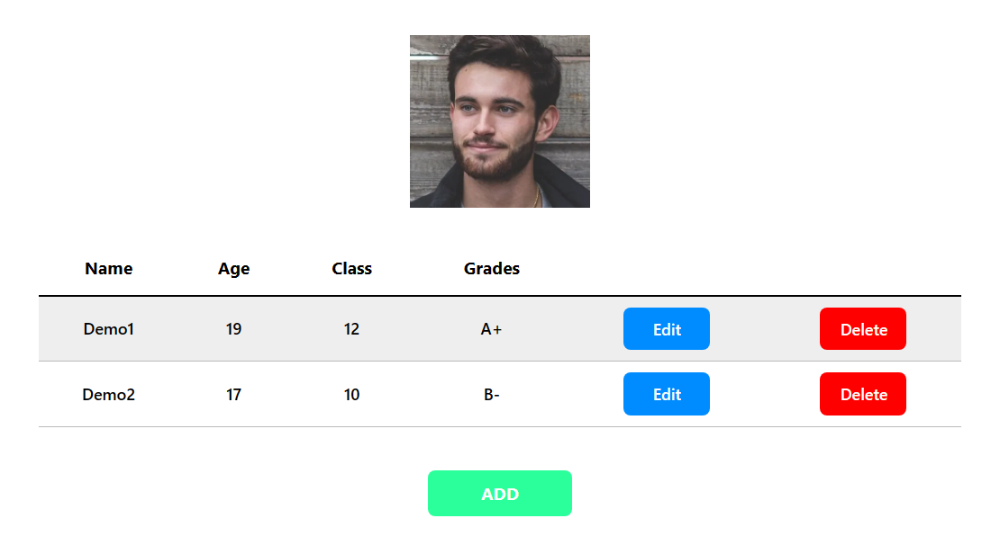

    <h1>Full Stack CRUD App</h1>
    
    <h2>Sample project showcasing CRUD operations with React on the frontend and .NetCore Web API with PostgreSQL on the backend</h2>
    <h3><a href="https://rush1dan-react-dotnet-crud.onrender.com" target="_blank">View Live Demo</a></h3>

### About
This is basically a practise project for demonstrating my fullstack development skills. It has simple CRUD (Create, Read, Update, Delete) operations implemented on the backend with .NETCore Web API, connecting to a PostgreSQL cloud database on Supabase. It is a demo student database application which can be interacted with through the simple UI built with React, JavaScript and plain CSS.

### Built With

<h4>Front End:</h4>

<h4>Back End:</h4>

